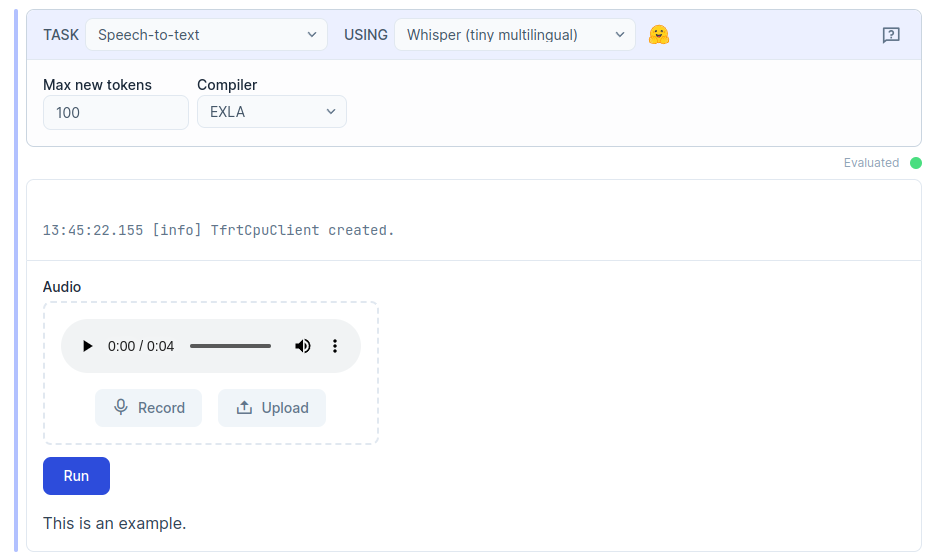
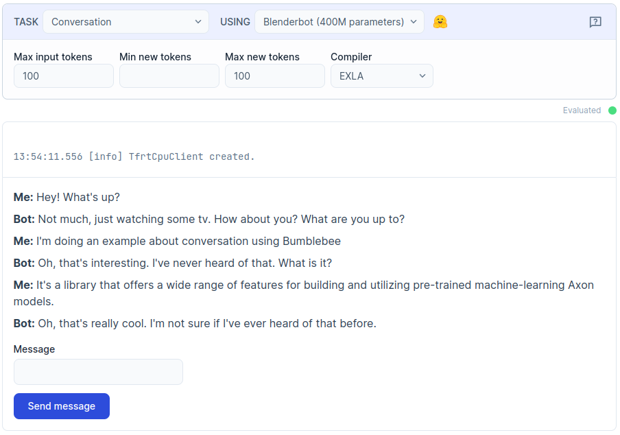
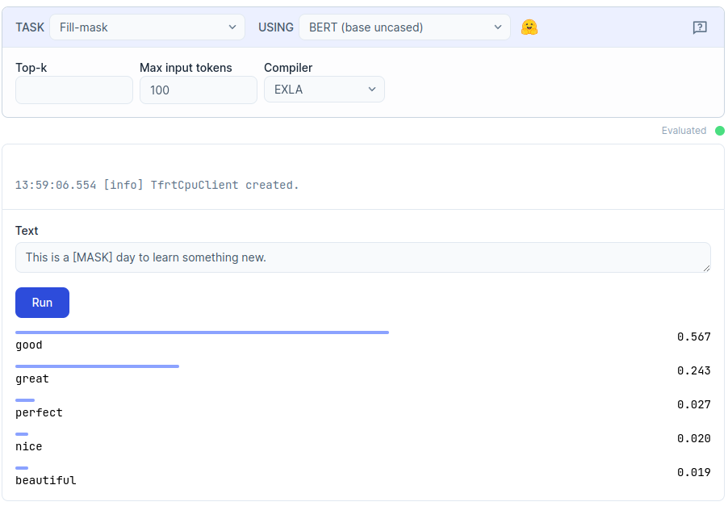
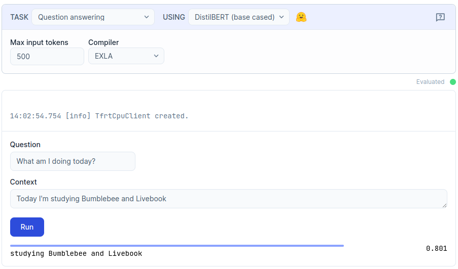
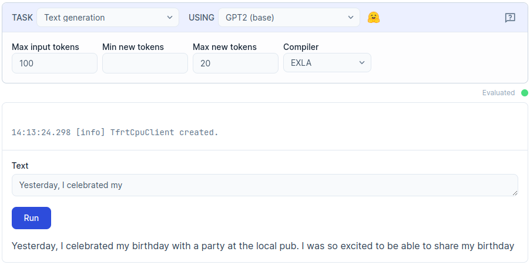
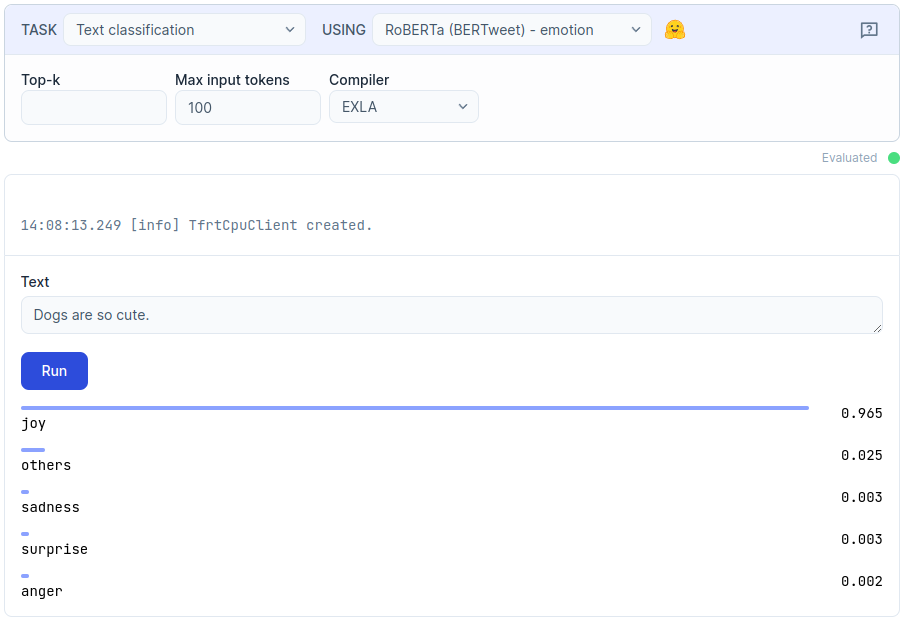
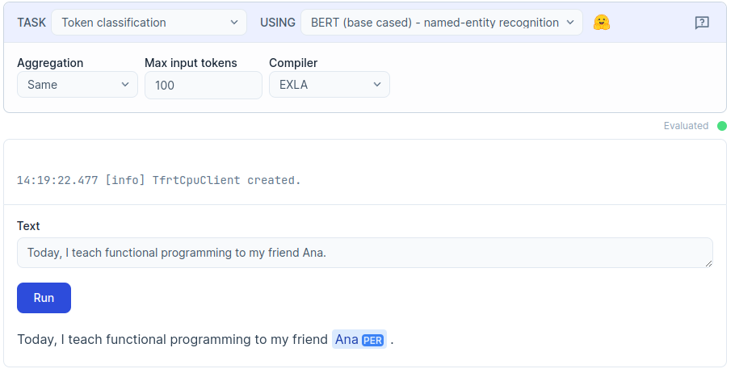
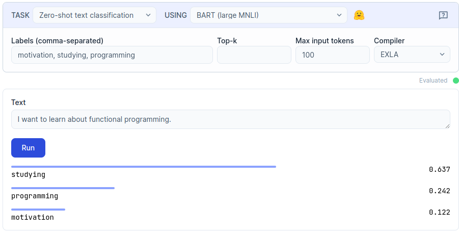
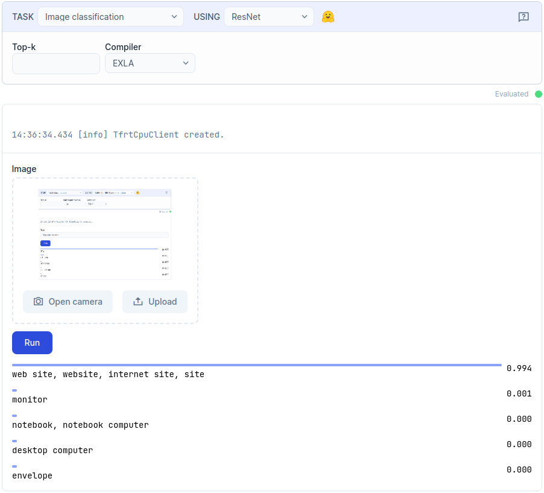
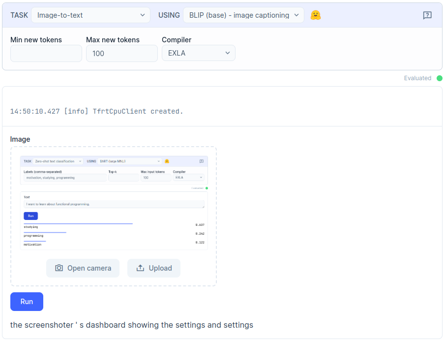

# **Bumblebee Tasks Demo**

Welcome to the Bumblebee Task Examples repository! This repository aims to provide a comprehensive collection of examples showcasing the various types of tasks that can be developed using the Bumblebee library.

# **Examples**

## **Audio task**

### **Spech-to-text**

## **Diffusion task**

## **Text task**
### **Conversation**

### **Fill mask**

### **Question answering**

### **Text generation**

### **Text classification**

### **Token classification**

### **Zero-Shot classification**

## **Vision task**

### **Image classification**

### **Image to text**

## Changelog

Features and bug fixes are listed in the [CHANGELOG][changelog] file.

## Code of conduct

We welcome everyone to contribute. Make sure you have read the [CODE_OF_CONDUCT][coc] before.

## Contributing

For information on how to contribute, please refer to our [CONTRIBUTING][contributing] guide.

## License

This library is licensed under an MIT license. See [LICENSE][license] for details.

## Acknowledgements

Made with 💙 by [kommitters Open Source](https://kommit.co)

[license]: https://github.com/kommitters/.template/blob/main/LICENSE
[coc]: https://github.com/kommitters/.template/blob/main/CODE_OF_CONDUCT.md
[changelog]: https://github.com/kommitters/.template/blob/main/CHANGELOG.md
[contributing]: https://github.com/kommitters/.template/blob/main/CONTRIBUTING.md
